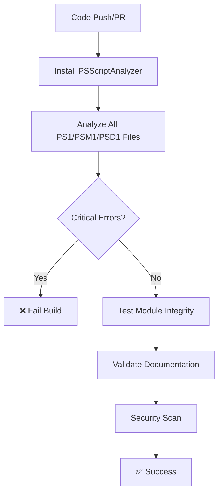
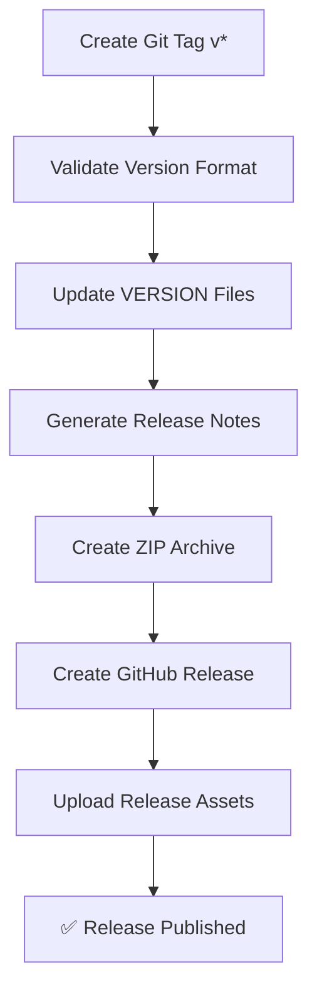

# 🔄 CI/CD Documentation

This directory contains GitHub Actions workflows, issue templates, and community guidelines for the Windows Server Lab Environment.

## 🎯 Workflows Overview

### 1. **CI/CD - PowerShell Lab Validation** (`ci.yml`)

**Triggers:**

- Push to `main`, `dev`, `development` branches
- Pull requests to `main`, `dev`, `development` branches
- Manual dispatch

**Jobs:**

- **PowerShell Script Analysis** - PSScriptAnalyzer validation
- **Module Integrity Testing** - Validates PowerShell module structure
- **Documentation Validation** - Checks for required documentation
- **Security Scanning** - DevSkim security analysis

**What it does:**

- ✅ Validates PowerShell script syntax and quality
- ✅ Tests module integrity and function exports
- ✅ Ensures documentation completeness
- ✅ Scans for security vulnerabilities
- ❌ Fails on critical errors, allows warnings

### 2. **Release Automation** (`release.yml`)

**Triggers:**

- Git tags matching `v*` pattern
- Manual dispatch with version input

**What it does:**

- ✅ Validates semantic versioning format
- ✅ Updates VERSION file and PowerShell module version
- ✅ Generates comprehensive release notes
- ✅ Creates ZIP archive with all lab components
- ✅ Creates GitHub release with assets
- ✅ Publishes downloadable lab environment

### 3. **Documentation** (`docs.yml`)

**Triggers:**

- Changes to Markdown files
- Changes to tutorial or demo documentation
- Pull requests affecting documentation

**What it does:**

- ✅ Validates markdown link integrity
- ✅ Checks documentation structure
- ✅ Auto-generates table of contents
- ✅ Commits TOC updates automatically

## 📋 Workflow Details

### PowerShell Validation Process



### Release Process



## 🔧 Configuration Files

### `markdown-link-check-config.json`

- **Purpose**: Configures markdown link validation
- **Features**:
  - Ignores localhost/local file links
  - Sets timeouts and retry policies
  - Handles rate limiting (429 responses)
  - Custom headers for GitHub URLs

## 📝 GitHub Templates

### Issue Templates

We provide structured issue templates to improve issue quality:

- **`bug_report.yml`**: Comprehensive bug reporting with environment details
- **`feature_request.yml`**: Feature requests with categorization and priority
- **`question.yml`**: Help and questions with troubleshooting guidance
- **`config.yml`**: Template configuration with helpful links

### Pull Request Template

- **`pull_request_template.md`**: Comprehensive PR template with:
  - Change type classification
  - Testing requirements
  - Documentation checklist
  - Breaking change guidance

### Community Files

- **`CODE_OF_CONDUCT.md`**: Community standards and behavior guidelines
- **`SECURITY.md`**: Security policy and vulnerability reporting
- **`SUPPORT.md`**: Support resources and help documentation
- **`FUNDING.yml`**: Sponsorship and funding configuration

## 🎯 Best Practices

### For Contributors

1. **Before Committing:**
   - Run `PSScriptAnalyzer` locally on your scripts
   - Test your PowerShell modules with `Test-ModuleIntegrity.ps1`
   - Validate markdown links in documentation
   - Follow the Code of Conduct and security guidelines

2. **Pull Request Guidelines:**
   - Use the PR template for consistency
   - CI must pass before merge
   - Fix critical errors, warnings are acceptable
   - Update documentation for new features
   - Include testing evidence in PR description

3. **Issue Reporting:**
   - Use appropriate issue templates (bug, feature, question)
   - Provide detailed environment information
   - Include reproducible steps and error messages
   - Check existing issues before creating duplicates

4. **Release Process:**
   - Create release tags with semantic versioning: `v1.2.3`
   - Use manual workflow dispatch for custom versions
   - Review generated release notes before publishing

### For Maintainers

1. **Workflow Maintenance:**
   - Update action versions regularly
   - Monitor for deprecated GitHub Actions
   - Review security scan results

2. **Quality Gates:**
   - Critical PowerShell errors block releases
   - Documentation must be complete
   - Security vulnerabilities should be addressed

## 🛠️ Local Testing

### PowerShell Analysis

```powershell
# Install PSScriptAnalyzer
Install-Module PSScriptAnalyzer -Force

# Analyze specific script
Invoke-ScriptAnalyzer -Path "Scripts/YourScript.ps1"

# Analyze all scripts
Get-ChildItem -Recurse -Include "*.ps1" | Invoke-ScriptAnalyzer
```

### Module Integrity

```powershell
# Test module integrity
cd Scripts
.\Test-ModuleIntegrity.ps1
```

### Documentation Links

```bash
# Install markdown-link-check
npm install -g markdown-link-check

# Check specific file
markdown-link-check README.md

# Check all markdown files
find . -name "*.md" | xargs markdown-link-check
```

## 📊 Workflow Status

### Current Status

- ✅ **PowerShell Validation** - Active and functional
- ✅ **Release Automation** - Active and functional  
- ✅ **Documentation Validation** - Active and functional
- ✅ **Security Scanning** - Integrated with DevSkim

### Metrics

- **Script Coverage**: All `.ps1`, `.psm1`, `.psd1` files
- **Documentation Coverage**: All `.md` files and tutorials
- **Security Coverage**: Full codebase scan
- **Release Automation**: Semantic versioning with full assets

## 🔮 Future Enhancements

### Planned Additions

1. **Pester Testing Integration** - Unit tests for PowerShell functions
2. **PowerShell Gallery Publishing** - Auto-publish module to PSGallery
3. **Performance Testing** - VM resource usage validation
4. **Integration Testing** - End-to-end lab deployment tests
5. **Dependency Scanning** - PowerShell module dependency analysis

### Potential Workflows

- **Nightly Builds** - Test with latest Windows Server ISOs
- **Multi-Platform Testing** - Test on different Windows versions
- **Performance Benchmarking** - Resource usage metrics
- **Documentation Site** - Auto-generate documentation website

---

## 🎉 Benefits

### For Users

- ✅ **Reliable Code** - All scripts validated before release
- ✅ **Complete Documentation** - Always up-to-date and verified
- ✅ **Secure Downloads** - Security-scanned releases
- ✅ **Easy Installation** - Automated release packages

### For Contributors  

- ✅ **Quick Feedback** - Immediate validation on PRs
- ✅ **Quality Assurance** - Automated quality gates
- ✅ **Documentation Help** - Auto-generated TOCs
- ✅ **Security Awareness** - Proactive vulnerability detection

### For Maintainers

- ✅ **Automated Releases** - No manual packaging required
- ✅ **Quality Control** - Consistent validation standards
- ✅ **Time Savings** - Automated routine tasks
- ✅ **Professional Standards** - Enterprise-grade CI/CD

---

*This CI/CD setup ensures the Windows Server Lab Environment maintains professional quality and reliability standards while automating routine maintenance tasks.*
