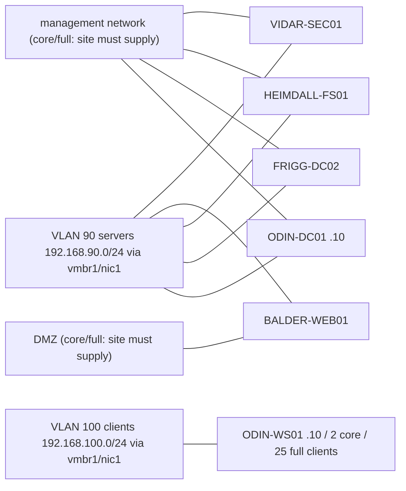

# Asgard v2 topology

Generated from `LabConfig/demos/asgard.json`. Site bridges and VLAN tags come from operator-local `LabConfig/site.json`; the defaults below are logical networks only.

`vmbr1` has no host address or gateway and carries only tagged VLANs 90 and 100. `vmbr0` keeps Proxmox management. Only one NIC per VM has a default gateway. Site firewalls must permit required client-to-DC AD/DNS traffic and enforce all other desired inter-VLAN flows; bridge/VLAN attachment alone is not proof of isolation.
