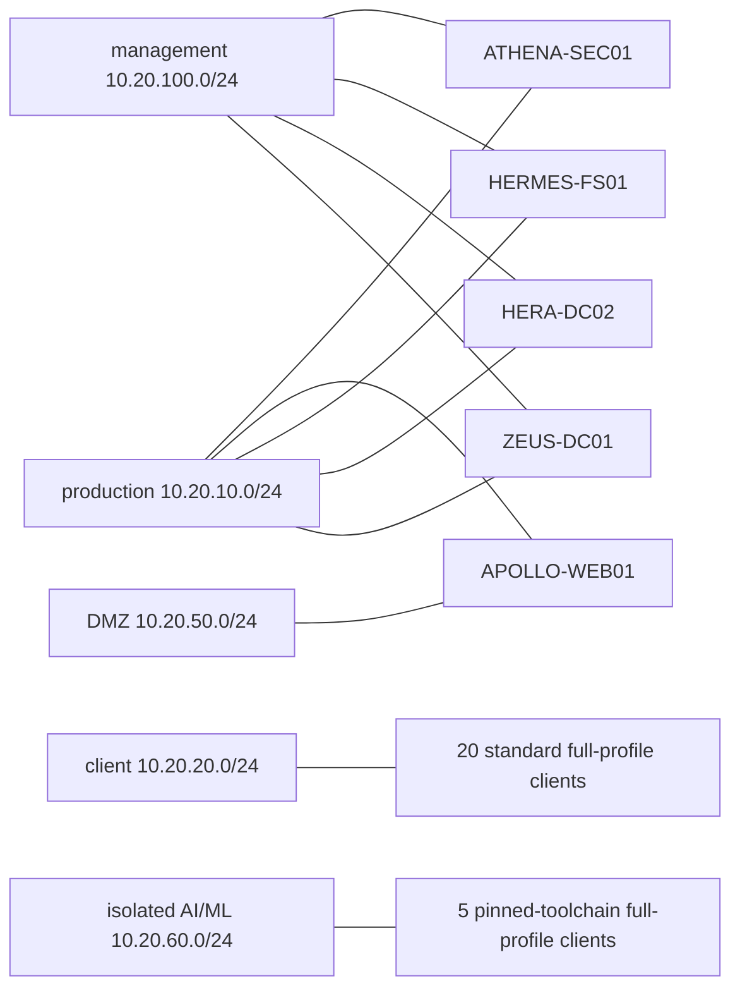

# Olympus v2 topology

Generated from `LabConfig/demos/olympus.json`. Site bridges and VLAN tags come from operator-local `LabConfig/site.json`; the defaults below are logical networks only.

The core profile selects two standard clients and no AI/ML client. Only one NIC per VM has a default gateway. Site firewalls must prove AI/ML and DMZ isolation; VLAN attachment alone is not sufficient.
